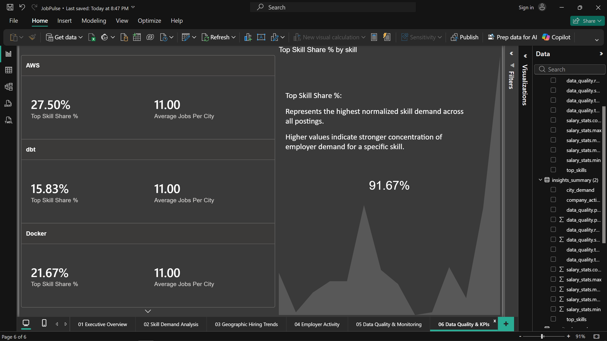
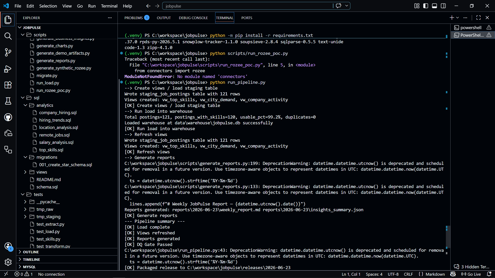

# JobPulse Pakistan ETL & Analytics Platform

> End-to-end Data Engineering project that transforms raw job postings into analytics-ready business insights through automated ETL pipelines, dimensional modeling, data quality monitoring, and interactive Power BI dashboards.

## Overview

JobPulse is a job market intelligence platform designed to analyze hiring trends across Pakistan.

The platform automatically ingests job postings, extracts technologies and business metadata, validates data quality, loads a dimensional warehouse, and exposes curated analytics for decision-makers through SQL and Power BI.

### Business Questions Answered

* Which technical skills are most in demand?
* Which cities have the highest hiring activity?
* Which companies are hiring the most?
* How complete and trustworthy is the collected data?
* What hiring trends can be identified from the market?

---

# Dashboard Preview

## Executive Overview


Provides a high-level snapshot of the Pakistan job market including:

* Total Jobs
* Total Skills Identified
* Total Companies Hiring
* Total Cities Represented

---

## Skill Demand Analysis


Ranks the most requested technologies and skills extracted from job descriptions.

Key Findings:

* TypeScript
* JavaScript
* SQL
* Python
* Cloud Technologies

---

## Geographic Hiring Trends


Visualizes hiring activity across major Pakistani cities and regional demand distribution.

---

## Employer Activity


Highlights the most active hiring organizations and recruitment patterns.

---

## Data Quality Monitoring


Tracks:

* Total Postings
* Posts With Skills
* Skill Coverage %
* Data Quality Status
* Pipeline Run Date

This layer demonstrates data governance and observability practices often missing from portfolio projects.

---

## KPI Analytics



Advanced KPI monitoring including:

* Top Skill Share %
* Average Jobs Per City
* Skill-specific demand metrics

---

# Architecture

## ETL Pipeline



```text
RemoteOK API
      ↓
Raw JSON Storage
      ↓
Staging Layer
      ↓
Transformation & Skill Extraction
      ↓
Data Quality Validation
      ↓
SQLite / PostgreSQL Warehouse
      ↓
SQL Analytics Views
      ↓
Power BI Dashboards
```

---

# Technical Stack

### Programming & Processing

* Python
* Pandas
* NumPy

### Data Engineering

* SQLAlchemy
* PostgreSQL
* SQLite
* DBT (Seeds & Analytics Layer)

### Data Collection

* Requests
* BeautifulSoup4
* Playwright (optional)

### Data Quality & Transformation

* FTFY
* RapidFuzz
* Pydantic

### Configuration & Automation

* Python-Dotenv
* Schedule

### Analytics & Visualization

* Power BI
* SQL Analytics Views
* PNG Reporting Artifacts

### Testing

* Pytest

---

# Data Warehouse Design

Star Schema consisting of:

### Dimension Tables

* dim_company
* dim_job
* dim_location
* dim_skill
* dim_date

### Fact Tables

* fact_job_postings
* fact_job_skills

Features:

* Surrogate Keys
* Primary / Foreign Key Relationships
* Analytics Views
* Idempotent Upserts
* Data Quality Validation

---

# Key Features

✅ Automated job posting ingestion

✅ Skill extraction from descriptions

✅ Location normalization

✅ Data quality monitoring framework

✅ Star-schema warehouse design

✅ SQL analytics layer

✅ Power BI dashboards

✅ Recruiter-ready business reporting

✅ SQLite demo environment

✅ PostgreSQL production support

---

# Results

## Dataset Summary

| Metric                 | Value  |
| ---------------------- | ------ |
| Total Jobs             | 121    |
| Total Skills Extracted | 520    |
| Total Companies        | 11     |
| Total Cities           | 11     |
| Skill Coverage         | 99.17% |
| Data Quality Status    | PASS   |

---

# Running the Project

## Setup

```bash
pip install -r requirements.txt
```

## Run ETL Pipeline

```bash
python run_pipeline.py
```

## Demo Mode (SQLite)

```bash
python scripts/demo_run.py
```

## Generate Reports

```bash
python scripts/generate_business_insights.py
```

---

# Project Structure

```text
connectors/      Data ingestion
etl/             ETL pipeline
sql/             Warehouse schema & views
scripts/         Utilities & reporting
docs/            Architecture & reports
media/           Dashboard screenshots
tests/           Unit tests
```

---

# Portfolio Highlights

* Designed and implemented an end-to-end ETL platform
* Built a dimensional warehouse using star-schema modeling
* Developed data quality monitoring and governance metrics
* Created Power BI dashboards for executive reporting
* Automated analytics artifact generation
* Produced recruiter-friendly business insights from raw job market data

---

## Author

Hooria Amir

Software Engineer | Data Engineering | Analytics Engineering | Business Intelligence

Open to opportunities in:

* Data Engineering
* Analytics Engineering
* Business Intelligence
* Data Analytics
* Software Engineering
