# JobPulse Pakistan ETL & Analytics Platform

> End-to-end Data Engineering, Analytics Engineering, and Business Intelligence platform that transforms Pakistan job market data into actionable insights through automated ETL pipelines, dimensional modeling, data quality monitoring, SQL analytics, and interactive Power BI dashboards.

---

## Overview

JobPulse is a job market intelligence platform designed to analyze hiring trends across Pakistan.

The platform collects job postings from Rozee.pk and other public job sources, extracts technologies and business metadata, validates data quality, loads a dimensional warehouse, and exposes analytics for decision-makers through SQL and Power BI.

### Business Questions Answered

* Which technical skills are most in demand?
* Which cities have the highest hiring activity?
* Which companies are hiring the most?
* How complete and trustworthy is the collected data?
* What hiring trends can be identified across the market?

---

## Project Highlights

* Built an end-to-end ETL pipeline using Python
* Extracted and normalized job data from Rozee.pk and public job sources
* Implemented automated skill extraction and classification
* Designed a dimensional star-schema warehouse
* Added automated data quality validation and monitoring
* Created SQL analytics views for business reporting
* Developed a 6-page Power BI dashboard
* Generated analytics-ready datasets and reports
* Supported both SQLite (demo) and PostgreSQL (production)

---

# Dashboard Showcase

## Power BI Dashboard Pages

1. Executive Overview
2. Skill Demand Analysis
3. Geographic Hiring Trends
4. Employer Activity
5. Data Quality Monitoring
6. KPI Analytics

---

### Youtube Video Demonstration

Watch JobPulse in action: [Project Demo (YouTube)](https://youtu.be/j7RKeEzvwmE)

---

### Executive Overview

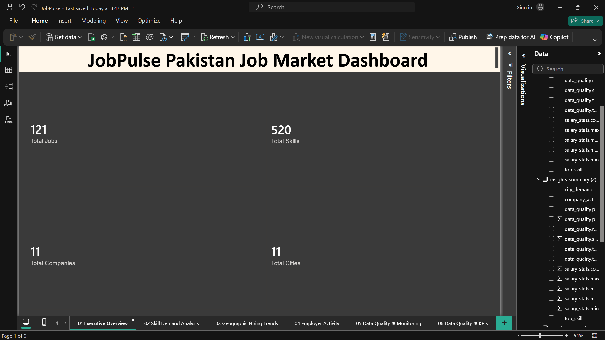

Provides a high-level snapshot of:

* Total Jobs
* Total Skills Extracted
* Total Companies Hiring
* Total Cities Represented

---

### Skill Demand Analysis

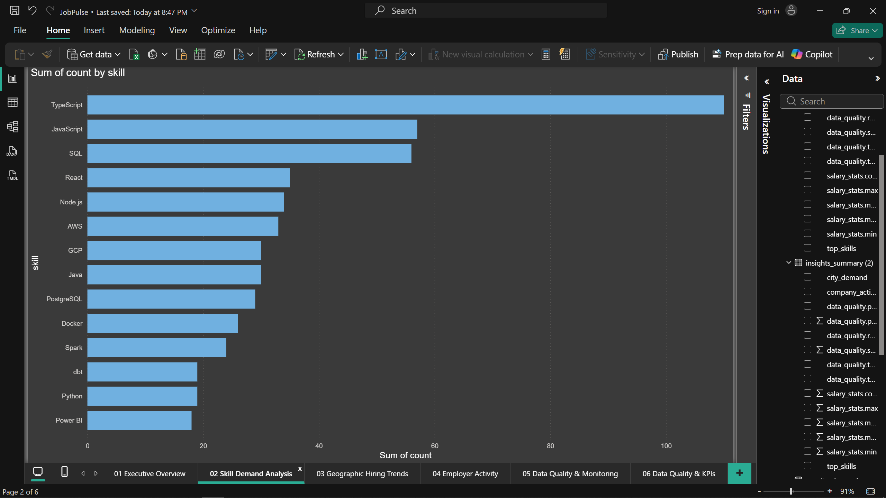

Ranks the most requested technologies and skills extracted from job postings.

**Top Skills Identified**

* TypeScript
* JavaScript
* SQL
* Python
* AWS

---

### Geographic Hiring Trends

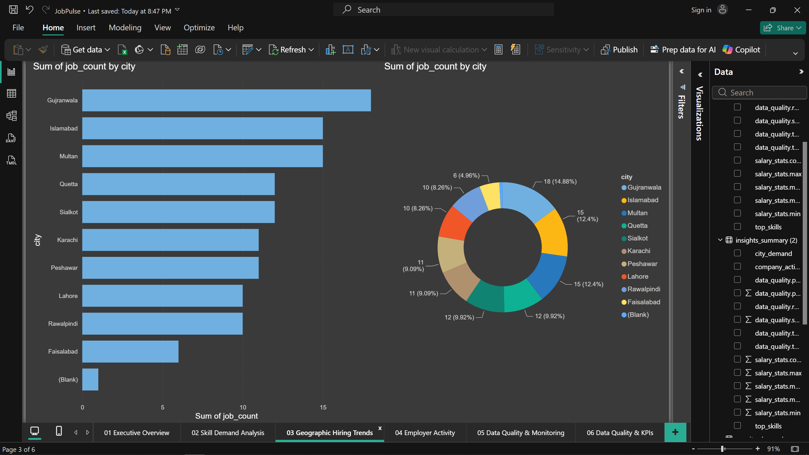

Visualizes hiring activity across Pakistani cities and regional demand distribution.

---

### Employer Activity

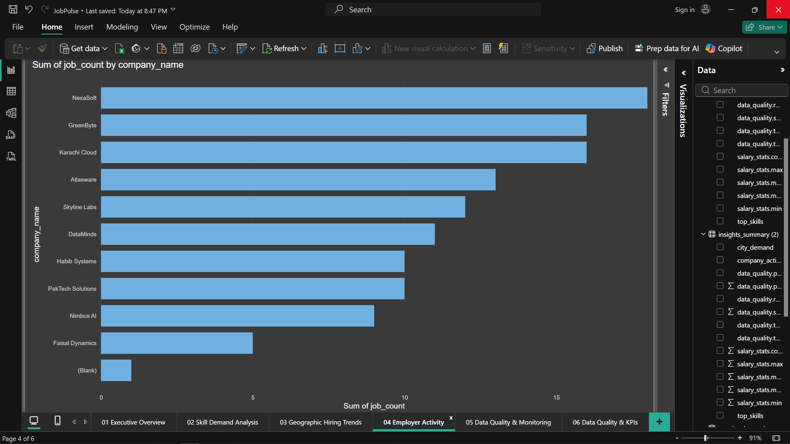

Highlights the most active hiring organizations and recruitment patterns.

---

### Data Quality Monitoring

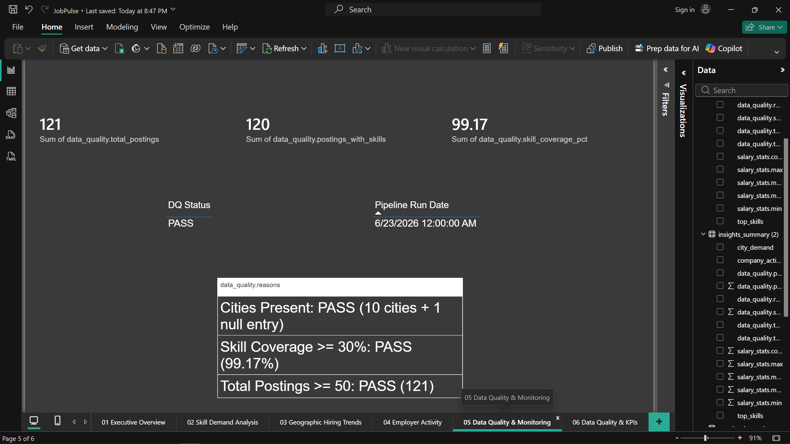

Tracks:

* Total Postings
* Posts With Skills
* Skill Coverage %
* Data Quality Status
* Pipeline Health

---

### KPI Analytics


Advanced KPI monitoring including:

* Top Skill Share %
* Average Jobs Per City
* Skill-specific demand metrics

---

# End-to-End Architecture

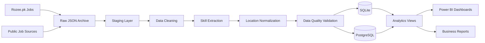

---

# Data Warehouse Design

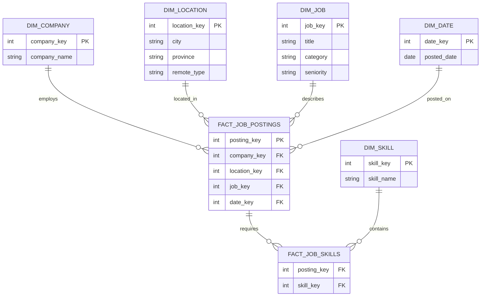

---

# ETL Pipeline Walkthrough

## 1. Raw Data Extraction

Job postings are collected from Rozee.pk and archived as raw JSON for traceability and reproducibility.

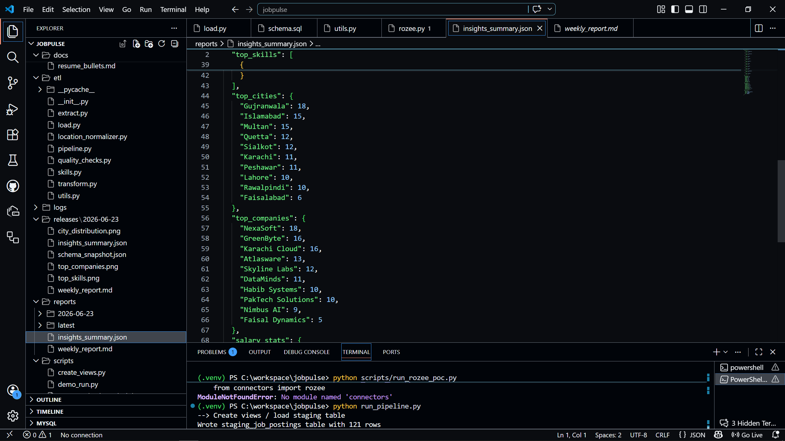

### Example Rozee.pk Source Data

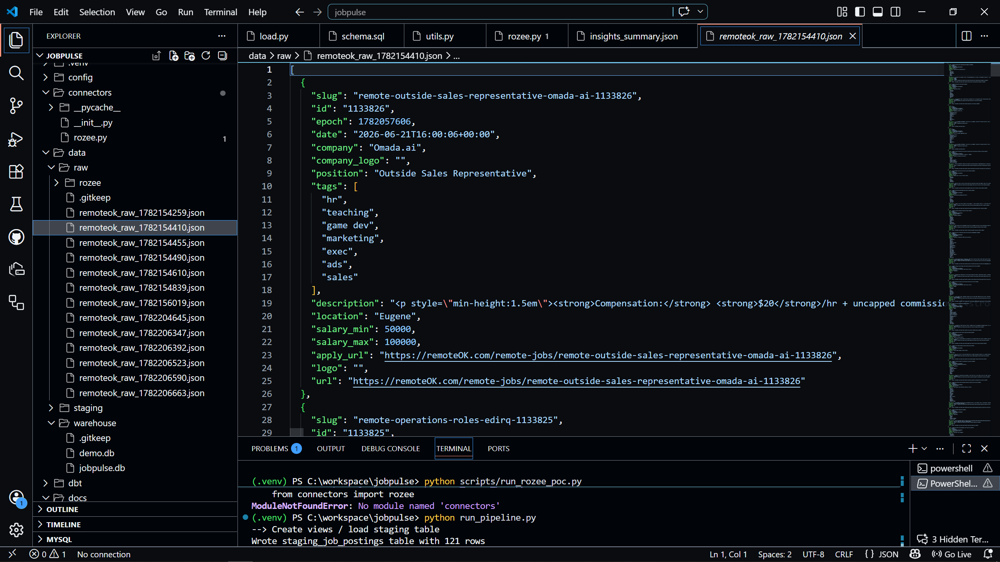

---

## 2. Staging Layer

Raw records are standardized, cleaned, and transformed into analytics-ready datasets.

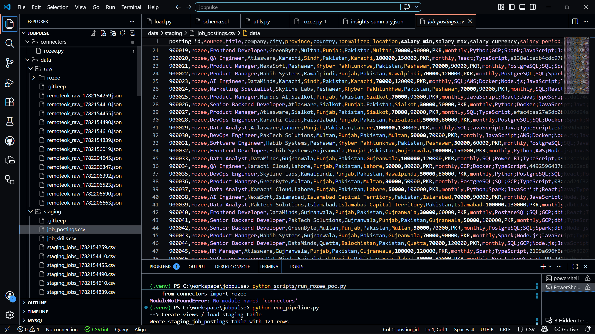

Processes include:

* Text normalization
* Salary parsing
* Seniority classification
* Skill extraction
* Location normalization

---

## 3. Pipeline Orchestration

Core ETL orchestration responsible for extraction, transformation, validation, and loading.


---

## 4. Automated Reporting

Python-generated charts and business analytics artifacts.

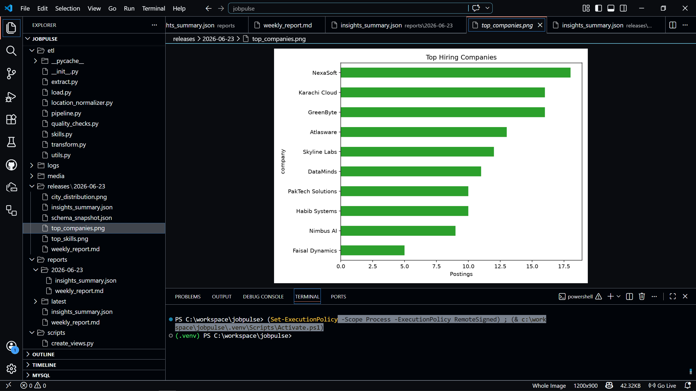

---

# Technical Stack

## Programming & Data Processing

* Python
* Pandas
* NumPy

## Data Collection

* Requests
* BeautifulSoup4
* Playwright (Optional)
* Rozee.pk Connector

## Data Engineering

* SQLAlchemy
* PostgreSQL
* SQLite
* DBT Core
* SQL Analytics Views
* Star Schema Modeling

## Data Quality & Transformation

* RapidFuzz
* FTFY
* Pydantic
* Skill Extraction Engine
* Location Normalization Framework

## Configuration & Automation

* Python-Dotenv
* Schedule

## Analytics & Visualization

* Power BI
* SQL
* CSV Exports
* PNG Reporting Artifacts

## Testing

* Pytest

---

# Data Quality Framework

The pipeline automatically generates quality metrics and validation reports.

### Monitored Metrics

* Total Postings
* Postings With Skills
* Skill Coverage %
* Missing Values
* Duplicate Records
* Data Quality Status

### Current Results

| Metric              | Value  |
| ------------------- | ------ |
| Total Jobs          | 121    |
| Posts With Skills   | 120    |
| Skill Coverage      | 99.17% |
| Data Quality Status | PASS   |
| Companies           | 11     |
| Cities              | 11     |

---

# Data Warehouse

### Dimension Tables

* dim_company
* dim_job
* dim_location
* dim_skill
* dim_date

### Fact Tables

* fact_job_postings
* fact_job_skills

### Warehouse Features

* Star Schema Design
* Surrogate Keys
* Primary & Foreign Keys
* Analytics Views
* Idempotent Upserts
* Data Quality Validation

---

# Results

| Metric                 | Value  |
| ---------------------- | ------ |
| Total Jobs             | 121    |
| Total Skills Extracted | 520    |
| Total Companies        | 11     |
| Total Cities           | 11     |
| Skill Coverage         | 99.17% |
| Data Quality Status    | PASS   |

---

# Running the Project

## Install Dependencies

```bash
pip install -r requirements.txt
```

## Run ETL Pipeline

```bash
python run_pipeline.py
```

## Interactive Dashboard

```bash
pip install -r requirements.txt
streamlit run streamlit_app.py
```

## Demo Mode (SQLite)

```bash
python scripts/demo_run.py
```

## Generate Reports

```bash
python scripts/generate_business_insights.py
```

---

# Repository Structure

```text
config/          Configuration files
connectors/      Source connectors
etl/             ETL pipeline logic
sql/             Schema, migrations, analytics views
scripts/         Utilities and reporting
docs/            Documentation and reports
media/           Dashboard screenshots
tests/           Automated testing
```

---

# Portfolio Highlights

* Designed and implemented an end-to-end ETL platform
* Built a dimensional warehouse using star-schema modeling
* Developed automated skill extraction and classification
* Implemented data quality monitoring and governance metrics
* Created Power BI dashboards for executive reporting
* Generated recruiter-friendly business insights from raw job market data
* Automated analytics artifact generation and reporting
* Supported SQLite and PostgreSQL deployments

---

# Author

**Hooria Amir**

Software Engineer | Data Engineering | Analytics Engineering | Business Intelligence

Open to opportunities in:

* Data Engineering
* Analytics Engineering
* Business Intelligence
* Data Analytics
* Software Engineering

### Connect

* LinkedIn: https://www.linkedin.com/in/hooryaa/
* Portfolio: https://hooria-portfolio.vercel.app/
* GitHub: https://github.com/hooryaa
